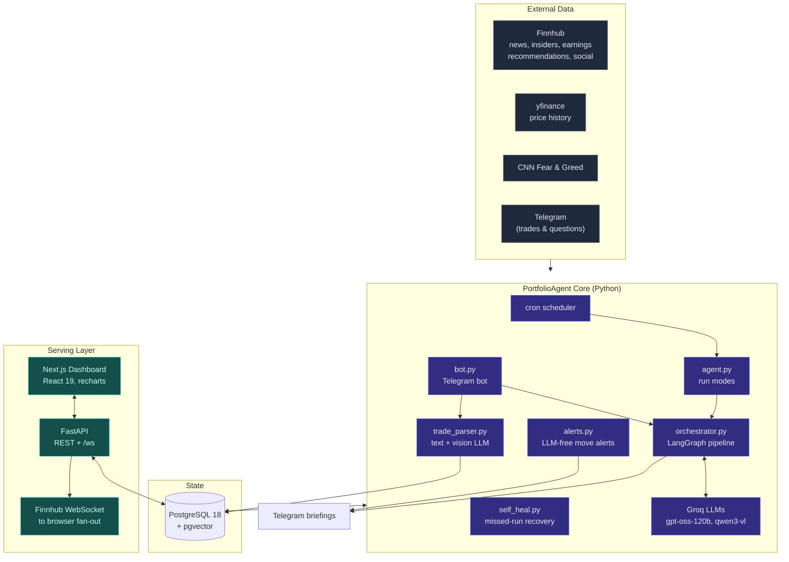
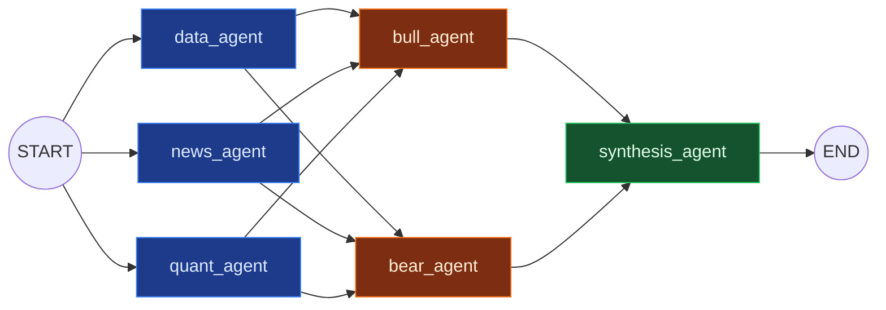

# PortfolioAgent

> A self-hosted, multi-agent AI system that monitors a live investment portfolio, evaluates both bullish and bearish outlooks, and delivers briefings over Telegram, backed by a real-time web dashboard.

PortfolioAgent is a personal quantitative research assistant. Six specialist LLM agents run on a schedule and on demand, gathering live market data, news, insider activity, and quantitative metrics, then argue a bull and bear case before synthesizing a concise, plain-English briefing. Trades are logged by texting the bot directly, or by sending a screenshot of a broker confirmation, which a vision model parses automatically.

<p align="center">
  
  
  
  
  
  
</p>

---

## Table of contents

- [Overview](#overview)
- [Highlights](#highlights)
- [Architecture](#architecture)
- [The multi-agent pipeline](#the-multi-agent-pipeline)
- [Data sources](#data-sources)
- [Quant toolkit](#quant-toolkit)
- [The Telegram bot](#the-telegram-bot)
- [Scheduled intelligence](#scheduled-intelligence)
- [Web dashboard & live prices](#web-dashboard--live-prices)
- [Tech stack](#tech-stack)
- [Project structure](#project-structure)
- [Data model](#data-model)
- [Getting started](#getting-started)
- [Deployment](#deployment)
- [Engineering notes](#engineering-notes)
- [Disclaimer](#disclaimer)

---

## Overview

PortfolioAgent was built to provide interpreted, decision-ready analysis of a personal portfolio rather than raw numbers or oversimplified summaries. It was designed around several goals:

- Produce clear, accessible explanations of portfolio performance and market conditions.
- Form a balanced view by explicitly generating and weighing opposing bull and bear cases.
- Combine live market data, news intelligence, and quantitative analysis in a single pipeline.
- Run entirely on self-hosted hardware, with all credentials kept server-side.

It also serves as a practical implementation of production agentic-AI patterns: parallel graph execution, retry and backoff around unreliable networks, rate-limit-aware prompt budgeting, and decision memory that keeps agent conclusions consistent over time.

---

## Highlights

- **6-agent LangGraph pipeline** with parallel fan-out and a dedicated bull/bear debate stage.
- **Multimodal trade logging.** Trades can be entered as text or as a broker screenshot parsed by a vision LLM.
- **Live streaming dashboard.** A single Finnhub WebSocket connection is fanned out to browsers; the API key never reaches the client.
- **Quantitative rigor.** Beta, correlation matrix, Sharpe and Sortino ratios, maximum drawdown, Monte Carlo simulation, and a benchmark backtest against VTI.
- **Decision memory.** The system retains recent conclusions to maintain consistency across runs.
- **Self-healing scheduler.** Missed or hung scheduled digests are detected and re-run automatically.
- **Security by default.** Rate limiting, restricted CORS, a read-only API, IPv4 pinning for unreliable routes, and retry/backoff throughout.

---

## Architecture



The system runs on a single self-hosted Ubuntu machine as three `systemd` services (API, bot, dashboard), exposed over Tailscale Funnel with automatic HTTPS.

---

## The multi-agent pipeline

The core of the system is a [LangGraph](https://langchain-ai.github.io/langgraph/) state graph. Three research agents run **in parallel**, feed a **bull/bear debate**, and a synthesis agent produces the final briefing.



| Agent | Role |
|-------|------|
| **data_agent** | Builds the portfolio snapshot: live prices, P&L, win/loss streaks, allocation, performance attribution, threshold alerts, and drift-from-target detection. |
| **news_agent** | Gathers full market intelligence (news, insider activity, earnings, analyst actions, social sentiment) and uses the LLM to synthesize the material points. |
| **quant_agent** | Runs the quantitative engine (beta, correlations, drawdown, Sharpe/Sortino, Monte Carlo) and interprets the results. |
| **bull_agent** | Constructs the strongest data-supported optimistic case over the next one to three months. |
| **bear_agent** | Constructs the strongest data-supported pessimistic case: concentration risk, downgrades, and macro headwinds. |
| **synthesis_agent** | Weighs both cases against recent decision memory and produces the final, mode-specific briefing. |

The graph adapts its output to the current **mode** (morning, intraday, daily, friday, weekly, interactive), ranging from a brief intraday note to a full weekend report with charts. Intraday runs can return `SILENT` when no notable event warrants a notification.

---

## Data sources

| Source | What it provides |
|--------|------------------|
| **Finnhub** | Company news, insider sentiment and transactions, analyst recommendations, upcoming earnings and surprises, upgrades and downgrades, price targets, congressional trading, Reddit and social sentiment, ETF holdings and sector exposure, economic calendar. |
| **Finnhub WebSocket** | Real-time trade ticks for live prices. |
| **yfinance** | Historical daily closes for the quant engine and dividend history. |
| **CNN Fear & Greed Index** | Market sentiment, with sustained-fear detection. |

---

## Quant toolkit

`quant.py` computes portfolio statistics over aligned return series:

- **Beta** of each holding relative to the S&P 500.
- **Correlation matrix** across holdings.
- **Maximum drawdown** with trough and recovery dates.
- **Sharpe and Sortino** ratios (configurable risk-free rate).
- **Monte Carlo simulation** of forward portfolio value (default 1,000 runs over 252 trading days).
- **Benchmark backtest** against VTI as a total-market reference.

The REST API also exposes `/portfolio/quant-metrics`, which explicitly flags partial data (for example, closed positions missing a recorded sale price) rather than reporting an incomplete figure as if it were complete.

---

## The Telegram bot

The bot is the primary interface to the system:

- **Interactive questions.** Free-text questions trigger the full agent pipeline in interactive mode and return a chunked response.
- **Text trade logging.** Input such as "bought 2 NVDA at 178" is parsed by an LLM into a structured trade and shown for confirmation.
- **Screenshot trade logging.** A broker confirmation image is parsed by a vision model (`qwen3-vl`). The Telegram file URL embeds the bot token, so the image is downloaded to bytes first and never sent to a third party.
- **Inline confirmation.** Every trade is confirmed before it is written to the database.
- **Commands.** `/menu` provides quick actions, and `/target` sets target allocations that drive drift alerts.

---

## Scheduled intelligence

Cron runs `agent.py` in different modes (ET):

| When | Mode | Output |
|------|------|--------|
| 8:55 AM (weekdays) | `--morning` | Pre-market briefing (with disclaimer). |
| Every 30 min, market hours | *(default)* intraday | Notable-move check; silent if nothing is material. |
| 4:05 PM (weekdays) | `--summary` | End-of-day summary. |
| 4:35 PM (Friday) | `--friday` | Weekly P&L digest. |
| 9:00 AM (Saturday) | `--weekly` | Full weekend report with charts. |
| Every 5 min, market hours | `alerts.py` | LLM-free big-move alerts (per-ticker bands, deduplicated). |
| After each digest | `self_heal.py` | Re-runs any scheduled digest that failed or hung. |

Every run is recorded in `agent_runs`, allowing `self_heal.py` to detect stuck or failed jobs. Any top-level failure sends a plain fallback Telegram alert.

---

## Web dashboard & live prices

A **Next.js 16 / React 19** dashboard (Tailwind 4, Recharts, Framer Motion) visualizes holdings, history, quant metrics, sparklines, the Fear & Greed index, and news.

Live prices use a fan-out pattern: a single asyncio task holds the one permitted Finnhub WebSocket connection, subscribes to all active holdings plus SPY, and broadcasts every tick to browsers connected to the FastAPI `/ws` endpoint. The Finnhub key remains server-side and is never exposed to the browser. The subscription list refreshes every 5 minutes so newly purchased tickers begin streaming automatically.

**Key API endpoints:** `/portfolio`, `/portfolio/history`, `/portfolio/analysis`, `/portfolio/quant`, `/portfolio/quant-metrics`, `/portfolio/sparklines`, `/fear-greed`, `/news`, `/ws`, `/health`.

---

## Tech stack

| Layer | Tech |
|-------|------|
| **Agents / LLM** | LangGraph, LangChain, Groq (`openai/gpt-oss-120b` for reasoning, `qwen3-vl` for vision) |
| **Backend** | Python 3.14, FastAPI, Uvicorn, websockets |
| **Bot** | python-telegram-bot |
| **Quant** | NumPy, pandas, matplotlib |
| **Data** | Finnhub, yfinance, CNN Fear & Greed |
| **Database** | PostgreSQL 18 + pgvector, psycopg2 |
| **Dashboard** | Next.js 16, React 19, Tailwind CSS 4, Recharts, Framer Motion |
| **Ops** | systemd, Tailscale Funnel, cron, slowapi (rate limiting) |

---

## Project structure

```
portfolioagent/
├── agent.py            # Cron entry point: run modes (morning/intraday/daily/friday/weekly)
├── orchestrator.py     # LangGraph 6-agent pipeline
├── bot.py              # Telegram bot (Q&A + trade logging)
├── trade_parser.py     # Text + vision LLM trade parsing
├── portfolio.py        # Shared DB utils, holdings, quotes, prompts
├── quant.py            # Beta, correlations, drawdown, Sharpe/Sortino, Monte Carlo
├── news.py             # Finnhub market intelligence
├── sentiment.py        # Fear & Greed index + sustained-fear detection
├── alerts.py           # LLM-free big-move alerts
├── self_heal.py        # Missed/hung run recovery
├── retry_utils.py      # Retry/backoff around rate limits & network gaps
├── tg_helpers.py       # Telegram send helpers
├── api/
│   ├── main.py         # FastAPI app + REST routes
│   ├── stream.py       # Finnhub WS to browser fan-out (/ws)
│   ├── quotes.py       # 30s TTL shared quote cache
│   └── db.py           # Connection pool
├── dashboard/          # Next.js frontend
├── db/                 # schema.sql + migrations
└── scripts/systemd/    # Service unit files
```

---

## Data model

PostgreSQL 18 (with pgvector). Core tables:

| Table | Purpose |
|-------|---------|
| `holdings` | Positions (ticker, shares, cost basis, buy/sell dates and prices). Active positions have `sold_at IS NULL`; a partial unique index enforces one open position per ticker. |
| `daily_closes` | One OHLCV row per ticker per day for the quant engine. |
| `daily_snapshots` | Portfolio value snapshots for history and charts. |
| `agent_logs` | Every reasoning run: prompt, response, whether it was sent, and the reason. |
| `agent_runs` | Run status (running/success/silent/skipped/failed) for self-healing. |
| `alert_state` | Deduplication state for big-move alerts. |
| `fear_greed_history` | Daily Fear & Greed readings. |
| `decision_memory` | Recent agent decisions, for cross-run consistency. |
| `target_allocation` | User targets that drive drift alerts. |
| `contributions` | Buy-transaction log. |
| `dividends` | Per-share dividend events from yfinance. |

---

## Getting started

> This is a single-user project (one authorized Telegram chat ID). It is provided as a reference and portfolio piece rather than a turnkey product, but the following outlines a local setup.

**Prerequisites:** Python 3.14, PostgreSQL 18 (+ pgvector), Node.js 20+, and a Telegram bot token.

```bash
# 1. Clone and enter
git clone https://github.com/aarush6848ddh/PortfolioAgent.git
cd PortfolioAgent

# 2. Python environment
python3 -m venv venv && source venv/bin/activate
pip install -r requirements.txt

# 3. Database
createdb portfolioagent
psql portfolioagent -c "CREATE EXTENSION IF NOT EXISTS vector;"
psql portfolioagent -f db/schema.sql
psql portfolioagent -f db/migrations_v2.sql
psql portfolioagent -f db/migrations_v3.sql

# 4. Configure secrets (see below)
cp .env.example .env   # then fill it in

# 5. Run the services
python bot.py                                   # Telegram bot
uvicorn api.main:app --host 127.0.0.1 --port 8000   # REST + /ws
python agent.py --morning                       # one-off briefing
cd dashboard && npm install && npm run dev      # dashboard
```

### Environment variables

**Required**

| Var | Purpose |
|-----|---------|
| `GROQ_API_KEY` | Groq LLM access. |
| `FINNHUB_API_KEY` | Market data and WebSocket. |
| `DATABASE_URL` | PostgreSQL connection string. |
| `TELEGRAM_BOT_TOKEN` | Telegram bot. |
| `TELEGRAM_CHAT_ID` | The authorized chat. |

**Optional tuning** (defaults shown)

| Var | Default | Meaning |
|-----|---------|---------|
| `BIG_MOVE_PCT` | `3.0` | Alert band per ticker. |
| `DRAWDOWN_ALERT_PCT` | `5.0` | Drawdown alert threshold. |
| `DRIFT_ALERT_PCT` | `10.0` | Allocation drift threshold. |
| `CONCENTRATION_BASE_PCT` / `CONCENTRATION_STEP_PCT` | `50` / `5` | Concentration alerting. |
| `FEAR_THRESHOLD` / `FEAR_SUSTAINED_DAYS` | `30` / `5` | Sustained-fear alert. |
| `MONTE_CARLO_SIMULATIONS` / `MONTE_CARLO_DAYS` | `1000` / `252` | Monte Carlo config. |
| `RISK_FREE_RATE` | `0.05` | For Sharpe/Sortino. |
| `MORNING_WORD_LIMIT` / `INTRADAY_WORD_LIMIT` | `150` / `80` | Briefing length caps. |
| `HEALTH_CHECK_PORT` | `8111` | Bot health check port. |

Secrets are kept in `.env` and are never hardcoded.

---

## Deployment

The system runs as three `systemd` services on a self-hosted Ubuntu machine:

```bash
sudo systemctl {status,restart} portfolio-api portfolio-bot portfolio-dashboard
journalctl -u portfolio-api -f
```

- **Networking:** uvicorn on `127.0.0.1:8000`, Next.js on `127.0.0.1:3000`, exposed via Tailscale Funnel (443 for the dashboard, 8443 for the API) with automatic HTTPS certificates.
- **Scheduling:** cron drives `agent.py`, `alerts.py`, and `self_heal.py`.
- **Deploy flow:** edit the local mirror, rsync to the server (excluding `venv`, `node_modules`, `.next`, `__pycache__`, and logs), run `npm run build` for the dashboard, then restart the services.

---

## Engineering notes

Selected implementation details:

- **Rate-limit-aware prompt budgeting.** Groq enforces a per-minute token cap. The synthesis agent combines all five reports, so it truncates its inputs to stay under the limit while preserving the appended decision memory that a naive head-slice would otherwise drop.
- **Retry and backoff for unreliable networks.** LLM and data calls retry with `2/8/30s` backoff on both rate-limit and connection errors, but fail fast on a non-retryable 413 ("prompt too large") rather than retrying an identical request.
- **IPv4 pinning.** yfinance and GitHub returned empty results because the host's IPv6 route was unreachable; the fix forces IPv4 for those hosts.
- **Honest metrics.** Quant results explicitly flag partial data (for example, `total_return_partial`) rather than reporting figures computed from missing values.
- **Self-healing.** `agent_runs` records each run's lifecycle, so a hung "running" row (no `finished_at`) can be detected and the digest re-triggered.
- **Security boundaries.** The Finnhub key never reaches the browser; the Telegram file URL (which embeds the bot token) is never sent to a third-party API; the API is read-only, CORS-restricted to the dashboard origin, and rate-limited per IP.

---

## Disclaimer

PortfolioAgent is a personal educational project. Its output is not financial advice. Conduct your own research before making investment decisions.
